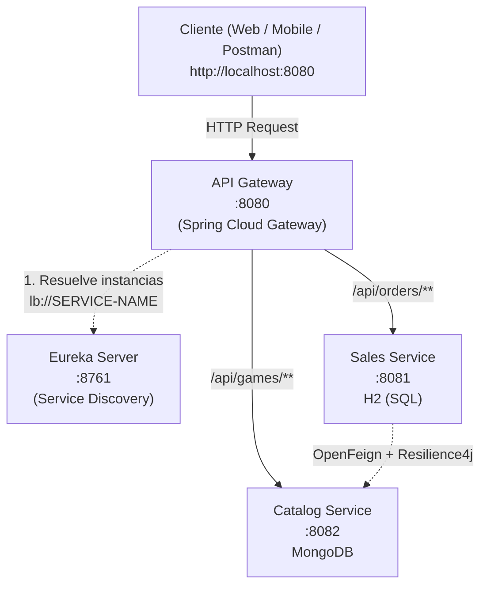
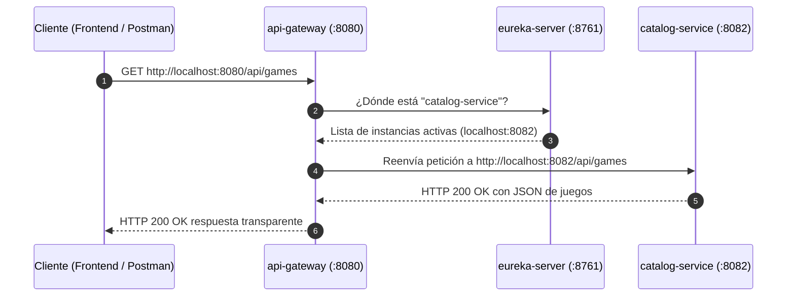

# API Gateway

> **Puerta de enlace unificada (Edge Service) y enrutador perimetral de alto rendimiento**, construido sobre una arquitectura de microservicios con Spring Cloud Gateway reactivo y Spring Cloud Netflix Eureka.


---

## Tabla de contenido

1. [Resumen del proyecto](#1-resumen-del-proyecto)
2. [Stack tecnológico y por qué se eligió](#2-stack-tecnológico-y-por-qué-se-eligió)
3. [Ecosistema de microservicios](#3-ecosistema-de-microservicios)
4. [Decisiones de arquitectura](#4-decisiones-de-arquitectura)
5. [Estrategia de enrutamiento dinámico](#5-estrategia-de-enrutamiento-dinámico)
6. [Flujo de una petición a través del Gateway](#6-flujo-de-una-petición-a-través-del-gateway)
7. [Estructura del proyecto](#7-estructura-del-proyecto)
8. [Configuración](#8-configuración)
9. [Instalación y ejecución](#9-instalación-y-ejecución)
10. [Guía de pruebas de enrutamiento](#10-guía-de-pruebas-de-enrutamiento)
11. [Solución de problemas](#11-solución-de-problemas)
12. [Mejoras futuras](#12-mejoras-futuras)

---

## 1. Resumen del proyecto

`api-gateway` es el **punto de contacto único (Single Point of Entry)** para todas las aplicaciones cliente (Frontend Web, Aplicaciones Móviles, Postman o herramientas de integración) que interactúan con el ecosistema **GameStore**.

| Responsabilidad | Descripción |
|---|---|
| Punto único de entrada | Expone el puerto oficial `8080`, ocultando la topología y puertos internos de los microservicios (`8081`, `8082`). |
| Enrutamiento dinámico | Redirige peticiones hacia `catalog-service` y `sales-service` basándose en el prefijo de la URL. |
| Balanceo de carga en cliente (Load Balancing) | Utiliza el prefijo `lb://` junto a Spring Cloud LoadBalancer y Eureka para distribuir la carga entre réplicas disponibles. |
| Abstracción y seguridad perimetral | Protege las instancias internas; los clientes nunca se comunican directamente con bases de datos ni con los servicios privados. |

**¿Por qué es indispensable en la arquitectura?**  
Sin un API Gateway, cada cliente frontend debería memorizar y configurar los puertos de cada microservicio, manejar problemas de CORS en múltiples servidores y sufrir interrupciones si una instancia cambia de IP o puerto. El Gateway centraliza estas complejidades en una sola capa reactiva y ultra veloz.

---

## 2. Stack tecnológico y por qué se eligió

| Tecnología | Versión | Función | ¿Por qué se usa? |
|---|---|---|---|
| Java | 17 | Lenguaje de programación | Estabilidad LTS y rendimiento moderno en la JVM. |
| Spring Boot | 4.1.1 | Framework base | Autoconfiguración y gestión de ciclo de vida del servicio. |
| Spring Cloud Gateway (WebFlux) | 5.0.3 | Motor de enrutamiento no bloqueante | Basado en Project Reactor y Netty, maneja miles de conexiones concurrentes con mínimo consumo de hilos y memoria. |
| Spring Cloud Netflix Eureka Client | 2025.1.3 | Descubrimiento de servicios | Descubre dinámicamente las instancias activas de los microservicios sin requerir IPs fijas. |
| Spring Cloud LoadBalancer | 5.0.3 | Balanceo de carga | Distribución de peticiones round-robin entre réplicas bajo el esquema `lb://`. |
| Lombok | (BOM de Boot) | Reducción de boilerplate | Código conciso y mantenible. |
| Maven Wrapper | — | Compilación portable | Garantiza compilación idéntica en cualquier entorno operativo. |

---

## 3. Ecosistema de microservicios

El Gateway gobierna el tráfico hacia los servicios del ecosistema:

| Servicio | Puerto | Base de datos | Rol | Repositorio |
|---|---|---|---|---|
| `eureka-server` | 8761 | — | Registro y descubrimiento de servicios | [Alger125/eureka-server](https://github.com/Alger125/eureka-server) |
| `api-gateway` | 8080 | — | Puerta de enlace y enrutamiento centralizado | *(este repositorio)* |
| `catalog-service` | 8082 | MongoDB | Catálogo e inventario NoSQL de videojuegos | [Alger125/catalog-service](https://github.com/Alger125/catalog-service) |
| `sales-service` | 8081 | H2 (SQL) | Facturación, órdenes y claves digitales | [Alger125/sales-service](https://github.com/Alger125/sales-service) |

### Diagrama de comunicación global



---

## 4. Decisiones de arquitectura

### 4.1 Enrutamiento Reactivo y Asíncrono (Netty sobre Tomcat)
- Spring Cloud Gateway corre sobre **Netty** (motor reactivo de E/S no bloqueante impulsado por Project Reactor).
- **Ventaja:** a diferencia del modelo de Servlet tradicional (un hilo por petición en Tomcat), Netty utiliza un bucle de eventos (*Event Loop*), permitiendo atender decenas de miles de peticiones simultáneas con una huella de memoria muy reducida (~150MB JVM).

### 4.2 Resolución Dinámica mediante `lb://` (Client-Side Load Balancing)
- Las rutas no apuntan a URLs fijas como `http://localhost:8082`.
- Apuntan al identificador lógico registrado en Eureka: `lb://catalog-service` y `lb://sales-service`.
- Si se levantan 3 réplicas de `catalog-service`, el Gateway distribuye automáticamente las peticiones entre ellas.

---

## 5. Estrategia de enrutamiento dinámico

| ID de Ruta | Prefijo Predicado | Destino (Eureka) | Descripción |
|---|---|---|---|
| `catalog-service-route` | `/api/games/**` | `lb://catalog-service` | Enruta consultas, altas y administración de videojuegos. |
| `sales-service-route` | `/api/orders/**` | `lb://sales-service` | Enruta compras, facturación y claves digitales. |

---

## 6. Flujo de una petición a través del Gateway



---

## 7. Estructura del proyecto

```
api-gateway/
├── .mvn/wrapper/                    # Maven Wrapper portable
├── src/
│   ├── main/
│   │   ├── java/com/jonathan/gamestore/gateway/
│   │   │   └── ApiGatewayApplication.java   # Entrada con @EnableDiscoveryClient
│   │   └── resources/
│   │       └── application.yml              # Reglas de enrutamiento y Eureka
│   └── test/
├── mvnw / mvnw.cmd                  # Ejecutables multiplataforma
├── pom.xml                          # Dependencias Spring Cloud Gateway
└── README.md
```

---

## 8. Configuración

Archivo: `src/main/resources/application.yml`

```yaml
server:
  port: 8080

spring:
  application:
    name: api-gateway
  cloud:
    gateway:
      discovery:
        locator:
          enabled: true
          lower-case-service-id: true
      routes:
        # Enrutamiento hacia Catalog Service (MongoDB)
        - id: catalog-service-route
          uri: lb://catalog-service
          predicates:
            - Path=/api/games/**

        # Enrutamiento hacia Sales Service (H2 SQL)
        - id: sales-service-route
          uri: lb://sales-service
          predicates:
            - Path=/api/orders/**

eureka:
  client:
    enabled: true
    service-url:
      defaultZone: http://localhost:8761/eureka/
```

---

## 9. Instalación y ejecución

### Requisitos previos
- **JDK 17** o superior (`java -version`).
- **Eureka Server** encendido en el puerto `8761`.

### Paso 1. Clonar el repositorio
```bash
git clone https://github.com/Alger125/api-gateway.git
cd api-gateway
```

### Paso 2. Ejecutar con Maven Wrapper
```bash
./mvnw spring-boot:run          # Windows: .\mvnw.cmd spring-boot:run
```

### Alternativa de bajo consumo de memoria (JVM 250MB)
```bash
./mvnw clean package -DskipTests
java -Xmx250m -jar target/api-gateway-0.0.1-SNAPSHOT.jar
```

---

## 10. Guía de pruebas de enrutamiento

Con `eureka-server`, `catalog-service`, `sales-service` y `api-gateway` encendidos, ejecuta estas pruebas apuntando **únicamente al puerto 8080**:

```powershell
# 1. Consultar catálogo a través del Gateway
Invoke-RestMethod -Uri "http://localhost:8080/api/games" -Method Get | ConvertTo-Json

# 2. Crear una orden de compra a través del Gateway
Invoke-RestMethod -Uri "http://localhost:8080/api/orders" -Method Post -ContentType "application/json" -Body '{
  "userId": 101,
  "items": [
    {
      "gameId": "ID_DE_MONGO_AQUI",
      "quantity": 1
    }
  ]
}' | ConvertTo-Json
```

---

## 11. Solución de problemas

| Síntoma | Causa probable | Solución |
|---|---|---|
| `503 Service Unavailable` | El microservicio de destino no está registrado en Eureka. | Asegurar que `catalog-service` o `sales-service` estén encendidos y registrados en `http://localhost:8761`. |
| `Connection refused` en `8080` | `api-gateway` no ha iniciado. | Verificar logs de arranque de `ApiGatewayApplication`. |
| `Cannot execute request on any known server` | Eureka no está encendido al arrancar el Gateway. | Levantar primero `eureka-server` en el puerto `8761`. |
| `404 Not Found` en rutas válidas | El prefijo en `Path` no coincide exactamente. | Comprobar que la URL comience con `/api/games/` o `/api/orders/`. |

---

## 12. Mejoras futuras

- **Seguridad Centralizada (JWT):** validar tokens Bearer en el Gateway antes de reenviar la petición a los microservicios internos.
- **Control de Tasa de Peticiones (Rate Limiting):** integración con Redis para limitar a 50 peticiones por minuto por dirección IP.
- **CORS Global:** habilitar cabeceras CORS unificadas para navegadores y SPAs (React / Angular / Vue).
- **Swagger UI Centralizado (Aggregator):** exponer una sola interfaz Swagger en `http://localhost:8080/swagger-ui.html` que agrupe la documentación OpenAPI de todos los microservicios.

---

## Autor

**Alger125** · [github.com/Alger125](https://github.com/Alger125)