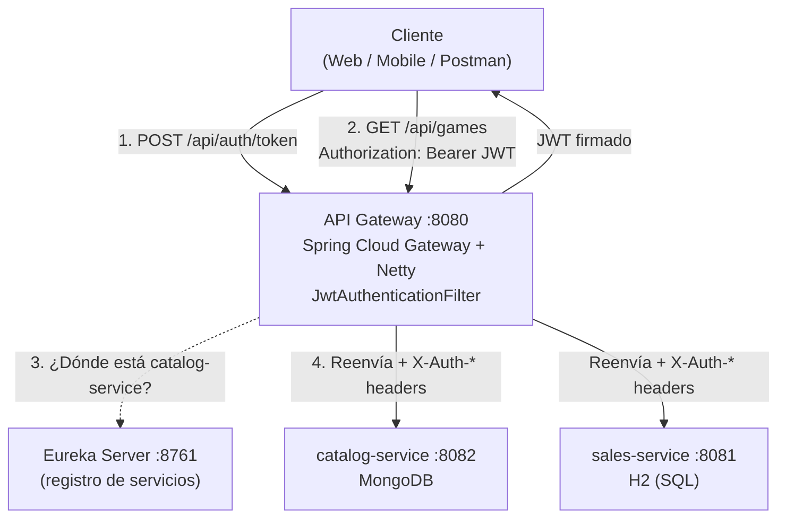
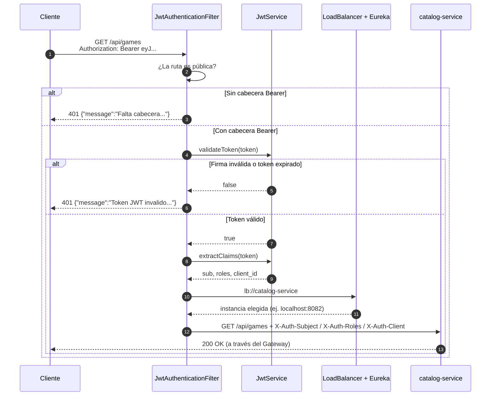
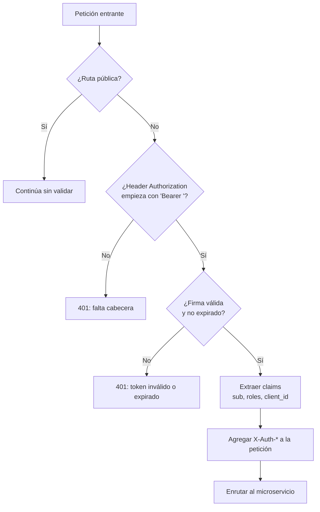
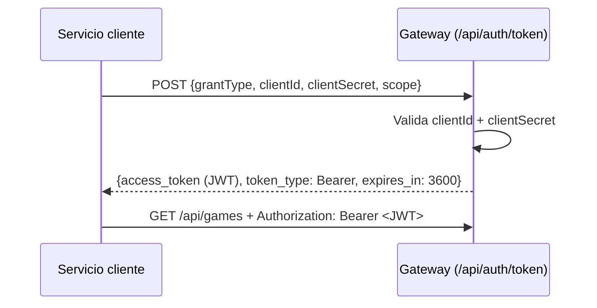
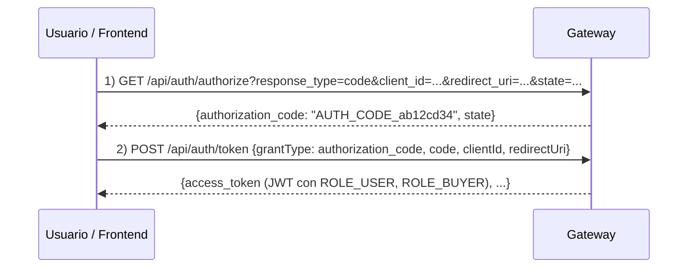

# API Gateway · GameStore

> **Punto único de entrada (Edge Service) del ecosistema de microservicios GameStore.**  
> Enruta peticiones reactivas de forma dinámica hacia `catalog-service` y `sales-service`, y protege perimetralmente el acceso validando **tokens JWT** emitidos por un **servidor OAuth 2.0 educativo** integrado en el proyecto.


-brightgreen)
-red)


---

## Tabla de contenido

1. [Resumen del proyecto](#1-resumen-del-proyecto)
2. [Conceptos previos (glosario para principiantes)](#2-conceptos-previos-glosario-para-principiantes)
3. [Stack tecnológico y por qué se eligió](#3-stack-tecnológico-y-por-qué-se-eligió)
4. [Arquitectura general](#4-arquitectura-general)
5. [Recorrido de una petición paso a paso](#5-recorrido-de-una-petición-paso-a-paso)
6. [Explicación del código, archivo por archivo](#6-explicación-del-código-archivo-por-archivo)
7. [JWT en detalle](#7-jwt-en-detalle)
8. [OAuth 2.0: flujos implementados](#8-oauth-20-flujos-implementados)
9. [mTLS: qué es y qué se implementó](#9-mtls-qué-es-y-qué-se-implementó)
10. [Referencia de endpoints](#10-referencia-de-endpoints)
11. [Enrutamiento y descubrimiento de servicios](#11-enrutamiento-y-descubrimiento-de-servicios)
12. [Estructura del proyecto](#12-estructura-del-proyecto)
13. [Configuración](#13-configuración)
14. [Instalación y ejecución](#14-instalación-y-ejecución)
15. [Batería de pruebas manuales (PowerShell & cURL)](#15-batería-de-pruebas-manuales-powershell--curl)
16. [Alcance real y limitaciones conocidas](#16-alcance-real-y-limitaciones-conocidas)
17. [Solución de problemas](#17-solución-de-problemas)
18. [Mejoras futuras](#18-mejoras-futuras)

---

## 1. Resumen del proyecto

`api-gateway` es la **única puerta de entrada** para los clientes (frontend web, app móvil, Postman) que consumen el ecosistema **GameStore**. Los clientes nunca hablan directamente con los microservicios: siempre pasan por el Gateway en el puerto `8080`.

| Responsabilidad | Qué hace en este proyecto |
|---|---|
| **Punto único de entrada** | Expone el puerto `8080` y oculta los puertos internos de los microservicios (`8081`, `8082`). |
| **Seguridad perimetral** | `JwtAuthenticationFilter` revisa cada petición enrutada; si no trae un JWT válido responde `401 Unauthorized`. |
| **Emisión de tokens (OAuth 2.0 educativo)** | `AuthController` expone `/api/auth/token` y `/api/auth/authorize`, con los flujos `client_credentials` y `authorization_code` **simulados** (ver [sección 16](#16-alcance-real-y-limitaciones-conocidas)). |
| **Enrutamiento** | Redirige `/api/games/**` → `catalog-service` y `/api/orders/**` → `sales-service`. |
| **Balanceo de carga** | El prefijo `lb://` + Eureka + Spring Cloud LoadBalancer reparte peticiones entre las réplicas disponibles. |
| **Propagación de identidad** | Tras validar el JWT, agrega las cabeceras `X-Auth-Subject`, `X-Auth-Roles` y `X-Auth-Client` para que los microservicios sepan quién llama. |

### ¿Qué es y qué NO es este proyecto?

| ✅ Sí es | ❌ No es (todavía) |
|---|---|
| Un gateway funcional con validación real de firma y expiración de JWT (librería JJWT). | Un servidor OAuth 2.0 de producción (no usa Spring Authorization Server, no hay base de usuarios ni persistencia de códigos). |
| Un proyecto didáctico para entender OAuth 2.0, JWT y la arquitectura de microservicios. | Una implementación de mTLS: el endpoint `/mtls-info` **solo explica** el concepto, no configura certificados. |

> Ser honesto sobre el alcance es una **fortaleza** en una entrevista: demuestra que entiendes la diferencia entre una simulación didáctica y una solución de producción.

---

## 2. Conceptos previos (glosario para principiantes)

| Término | Explicación sencilla |
|---|---|
| **Microservicios** | Aplicación dividida en servicios pequeños e independientes (aquí: catálogo y ventas), cada uno con su propia base de datos. |
| **API Gateway** | Un "recepcionista" que recibe todas las peticiones, verifica quién eres y te manda al servicio correcto. |
| **Edge / perimetral** | Que está en el borde de la red: lo primero que toca el tráfico externo. |
| **Programación reactiva / WebFlux / Netty** | Modelo **no bloqueante**: pocos hilos atienden miles de conexiones porque nunca se quedan esperando. `Mono<T>` representa "un resultado que llegará (o no) en el futuro". |
| **Service Discovery (Eureka)** | Una "agenda de contactos": cada servicio se registra con su nombre y el Gateway pregunta dónde está en vez de usar IPs fijas. |
| **Load Balancing del lado del cliente** | Si hay 3 copias de `catalog-service`, el Gateway elige una por turnos (round-robin). |
| **Autenticación vs Autorización** | *Autenticación*: ¿quién eres? *Autorización*: ¿qué puedes hacer? **Este proyecto implementa autenticación; la autorización por rol/scope aún no se aplica** (ver sección 16). |
| **OAuth 2.0** | Estándar para delegar acceso: en vez de compartir contraseñas, se emiten **tokens** con permisos acotados. |
| **JWT (JSON Web Token)** | Un token con tres partes (`header.payload.signature`) que viaja en cada petición y puede verificarse sin consultar una base de datos. |
| **Bearer token** | Forma de enviar el token: cabecera `Authorization: Bearer <token>`. "Bearer" = "portador": quien lo porta, lo usa. |
| **Claim** | Un dato dentro del payload del JWT (ej. `sub`, `exp`, `roles`). |
| **HMAC-SHA (HS256/HS384/HS512)** | Firma con **una sola clave secreta compartida** (simétrica). Quien la conoce puede firmar y verificar. |
| **mTLS** | TLS mutuo: cliente **y** servidor se identifican con certificados X.509. |
| **Zero-Trust** | Principio "nunca confíes, siempre verifica", incluso dentro de la red interna. |

---

## 3. Stack tecnológico y por qué se eligió

| Tecnología | Versión | Función | ¿Por qué se usa? |
|---|---|---|---|
| Java | 17 | Lenguaje | Versión LTS estable, base mínima de Spring Boot moderno. |
| Spring Boot | 4.1.1 | Framework base | Autoconfiguración, servidor embebido y gestión del ciclo de vida. |
| Spring Cloud Gateway (WebFlux) | gestionado por Spring Cloud `2025.1.3` | Enrutamiento y filtros | Construido sobre Reactor y Netty: no bloqueante, ideal para un proxy que solo "reenvía". |
| Spring Cloud Netflix Eureka Client | gestionado por Spring Cloud | Descubrimiento | Resuelve instancias por **nombre de servicio** y no por IP. |
| Spring Cloud LoadBalancer | gestionado por Spring Cloud | Balanceo | Necesario para que funcione el prefijo `lb://`. |
| JJWT (`io.jsonwebtoken`) | 0.12.6 | Crear/validar JWT | API fluida, verifica firma y expiración automáticamente. |
| Lombok | (BOM de Boot) | — | Declarada en el `pom.xml` pero **no se usa actualmente** en el código (los DTO tienen getters/setters manuales). |
| Maven Wrapper | — | Compilación | Cualquiera compila con la misma versión de Maven sin instalarla. |

> **¿Por qué WebFlux y no Spring MVC?** Un gateway pasa la mayor parte del tiempo *esperando* respuestas de otros servicios. Con hilos bloqueantes cada espera ocuparía un hilo; con el modelo reactivo, el mismo hilo atiende otras peticiones mientras espera.

---

## 4. Arquitectura general



### Decisiones de arquitectura y su justificación

**1) Un filtro global en lugar de validar en cada microservicio.**  
La seguridad se centraliza en un solo lugar (`JwtAuthenticationFilter`). Si cambia la política, se cambia en un solo proyecto y los microservicios se concentran en su lógica de negocio.

**2) Validación reactiva y rápida.**  
El filtro devuelve un `Mono<Void>`. Si el token es inválido, responde `401` de inmediato **sin llegar a tocar** el microservicio de destino.

**3) Propagación de identidad con cabeceras.**  
Después de validar el JWT, el Gateway agrega `X-Auth-Subject`, `X-Auth-Roles` y `X-Auth-Client`. Así los microservicios no necesitan decodificar el JWT. El método `mutate().header(...)` **sobrescribe** esos valores, por lo que un cliente malicioso no puede falsificarlos enviando sus propias cabeceras `X-Auth-*` en rutas protegidas.

> ⚠️ **Importante para ser preciso:** esta decisión funciona bien solo si los microservicios **no son accesibles directamente** desde fuera (red privada / firewall). Si alguien llega al puerto `8081` o `8082` saltándose el Gateway, podría enviar cabeceras `X-Auth-*` falsas. Es un modelo de **confianza en el perímetro**, no Zero-Trust completo (que exigiría que cada servicio también verifique el token o use mTLS).

---

## 5. Recorrido de una petición paso a paso

### 5.1 Diagrama de secuencia (petición protegida)



### 5.2 Lógica de decisión del filtro



---

## 6. Explicación del código, archivo por archivo

### 6.1 `ApiGatewayApplication.java`
Punto de entrada. `@SpringBootApplication` arranca la aplicación y `@EnableDiscoveryClient` indica que debe registrarse y descubrir servicios en Eureka. (En versiones recientes de Spring Cloud, esta anotación es opcional si la dependencia del cliente Eureka está presente, pero es válida y deja clara la intención.)

### 6.2 `security/JwtService.java` — el "fabricante y verificador" de tokens

| Método | Qué hace |
|---|---|
| Constructor | Lee `jwt.secret` (obligatorio, sin duplicar en duro) y `jwt.expiration-ms` de `application.yml` y construye la clave de firma con `Keys.hmacShaKeyFor(...)`. |
| `generateClientToken(clientId, scope)` | Token para el flujo `client_credentials`: `sub = clientId`, rol `ROLE_SERVICE`. |
| `generateUserToken(username, roles, scope)` | Token para el flujo `authorization_code`: `sub = username`, con los roles del usuario. |
| `buildToken(...)` (privado) | Arma el JWT: `typ`, `sub`, `iss`, `aud`, `iat`, `exp`, claims extra, y lo **firma** con `signWith(signingKey)`. |
| `validateToken(token)` | Intenta `parseSignedClaims`. Si la firma no coincide, el token expiró o está malformado → `false`. |
| `extractClaims(token)` | Devuelve el payload ya verificado. |
| `inspectToken(token)` | Devuelve un mapa legible con algoritmo dinámico detectado, sujeto, emisor, fechas y claims. |

Punto clave: `signWith(signingKey)` **elige el algoritmo según el tamaño de la clave**. El secreto configurado mide **74 bytes (592 bits)**, así que JJWT usa **HS512** (≥ 64 bytes → HS512, ≥ 48 → HS384, ≥ 32 → HS256).

### 6.3 `security/JwtAuthenticationFilter.java` — el "guardia de seguridad"

- Implementa `GlobalFilter` (se aplica a **todas las rutas enrutadas** del gateway) y `Ordered`.
- `getOrder()` devuelve `-1`: un número **bajo = prioridad alta**, por lo que corre antes de los filtros que resuelven el destino y reenvían la petición.
- `filter(...)` sigue el diagrama de la sección 5.2.
- `onError(...)` construye la respuesta `401` en JSON de forma **no bloqueante** (`response.writeWith(Mono.just(buffer))`) en lugar de lanzar una excepción.
- `PUBLIC_ENDPOINTS` lista los prefijos que no requieren token.

> 📝 **Nota técnica:** los `GlobalFilter` se ejecutan sobre peticiones que coinciden con rutas que el Gateway enruta a otro servicio. Los endpoints de `AuthController` son controladores locales atendidos directamente por WebFlux. Si se consulta una URL que **no existe** en las rutas (ej. `/api/xyz`), Spring Cloud Gateway devuelve **404 Not Found** directamente antes de que el filtro se ejecute.

### 6.4 `auth/controller/AuthController.java` — el servidor OAuth 2.0 educativo

- **`REGISTERED_CLIENTS`**: mapa en memoria con tres clientes de prueba y sus secretos.
- **`POST /api/auth/token`**: atiende dos `grantType`.
  - `client_credentials`: valida la presencia no nula de `clientId` + `clientSecret` y emite JWT con `ROLE_SERVICE`. Si son ausentes o incorrectos → `401 invalid_client` (protegido contra NPE de `Map.of`).
  - `authorization_code`: acepta cualquier código que empiece con `AUTH_CODE_` y emite un JWT para un usuario **simulado** (`gamer_pro_2026`, roles `ROLE_USER`, `ROLE_BUYER`). Si el código no es válido → `400 invalid_grant`.
  - Cualquier otro valor → `400 unsupported_grant_type`.
- **`GET /api/auth/authorize`**: exige `response_type=code`, genera `AUTH_CODE_` + 8 caracteres de un UUID y lo devuelve en JSON (un servidor real redirigiría al `redirect_uri`).
- **`POST /api/auth/inspect`**: recibe `{ "token": "..." }` y devuelve la estructura del JWT.
- **`GET /api/auth/mtls-info`**: devuelve texto explicativo sobre mTLS.

### 6.5 DTOs (`TokenRequest` y `TokenResponse`)
- `TokenRequest`: recibe el cuerpo JSON de `/token` (`grantType`, `clientId`, `clientSecret`, `code`, `redirectUri`, `scope`).
- `TokenResponse`: usa `@JsonProperty` para serializar con los nombres del estándar OAuth 2.0 (`access_token`, `token_type`, `expires_in`, `scope`) e indica el algoritmo real en `token_structure`.

---

## 7. JWT en detalle

Un JWT son **tres bloques Base64URL separados por puntos**:

```
eyJhbGciOiJIUzUxMiJ9 . eyJzdWIiOiJzYWxlcy1zZXJ2aWNlLWNsaWVudCIs... . q8Zr...
└──── HEADER ────────┘   └──────────── PAYLOAD ────────────────────┘   └ FIRMA ┘
```

**Header** (ejemplo ilustrativo):
```json
{ "typ": "JWT", "alg": "HS512" }
```

**Payload** (ejemplo ilustrativo para `client_credentials`):
```json
{
  "sub": "sales-service-client",
  "iss": "gamestore-api-gateway",
  "aud": ["gamestore-microservices"],
  "iat": 1790000000,
  "exp": 1790003600,
  "grant_type": "client_credentials",
  "client_id": "sales-service-client",
  "scope": "games:read games:write orders:create",
  "roles": ["ROLE_SERVICE"]
}
```

| Claim | Significado |
|---|---|
| `sub` | *Subject*: a quién pertenece el token. |
| `iss` | *Issuer*: quién lo emitió. |
| `aud` | *Audience*: para quién está destinado. |
| `iat` / `exp` | Fecha de emisión / expiración (segundos desde 1970). Duración actual: `3600000 ms` = **1 hora**. |
| `roles`, `scope`, `client_id`, `grant_type` | Claims personalizados de este proyecto. |

**Firma:** `HMAC-SHA512( Base64URL(header) + "." + Base64URL(payload), claveSecreta )`.  
Si alguien modifica una sola letra del payload, la firma recalculada no coincide y `validateToken` devuelve `false`.

> ⚠️ **El payload NO está cifrado, solo codificado.** Cualquiera puede leerlo (por ejemplo en jwt.io). Nunca pongas contraseñas ni datos sensibles dentro de un JWT. La firma garantiza **integridad** (nadie lo modificó), no **confidencialidad**.

---

## 8. OAuth 2.0: flujos implementados

### 8.1 Roles de OAuth 2.0 en este proyecto

| Rol OAuth | Quién lo cumple aquí |
|---|---|
| Authorization Server (emite tokens) | El propio Gateway (`AuthController`) |
| Resource Server (valida tokens) | El propio Gateway (`JwtAuthenticationFilter`) y, detrás, los microservicios |
| Client | Postman / frontend / `sales-service-client`, etc. |

### 8.2 Flujo `client_credentials` (máquina a máquina)

Úsalo cuando **un servicio llama a otro sin intervención de una persona**.



### 8.3 Flujo `authorization_code` (con usuario)

Se hace en **dos fases**: primero se obtiene un código temporal y luego se canjea por el token.



- El parámetro **`state`** protege contra ataques CSRF: el cliente lo envía y debe recibir el mismo valor de vuelta.
- En un servidor real, el código es de **un solo uso**, **expira en ~1 minuto**, está ligado a un `client_id` y `redirect_uri`, y el usuario se autentica y da su consentimiento. Aquí todo eso está **simulado** (ver sección 16).

---

## 9. mTLS: qué es y qué se implementó

**TLS normal (HTTPS):** solo el cliente verifica al servidor.  
**mTLS (mutual TLS):** ambos presentan un certificado X.509 firmado por una CA de confianza y se verifican mutuamente.

Handshake simplificado:
1. `ClientHello` → 2. `ServerHello` + certificado del servidor + `CertificateRequest` → 3. el cliente valida el certificado del servidor → 4. el cliente envía su certificado + `CertificateVerify` → 5. el servidor valida al cliente → 6. se establece el canal cifrado.

**Beneficio:** un servicio o atacante sin certificado válido no puede ni siquiera abrir la conexión; es la base de redes Zero-Trust (normalmente automatizado con un *service mesh* como Istio o Linkerd).

> ⚠️ **Estado real:** en este proyecto **mTLS es solo conceptual**. `GET /api/auth/mtls-info` devuelve la explicación; no hay certificados, keystores ni configuración `server.ssl.*`.

---

## 10. Referencia de endpoints

| Método | Ruta | ¿Requiere JWT? | Descripción |
|---|---|---|---|
| `POST` | `/api/auth/token` | No | Emite un JWT (`client_credentials` o `authorization_code`). |
| `GET` | `/api/auth/authorize` | No | Genera un código de autorización simulado. |
| `POST` | `/api/auth/inspect` | No | Decodifica y valida un JWT. |
| `GET` | `/api/auth/mtls-info` | No | Explicación de mTLS. |
| `*` | `/actuator/**` | No (según filtro) | Solo disponible si agregas `spring-boot-starter-actuator`. |
| `*` | `/api/games/**` | **Sí** | Reenviado a `catalog-service`. |
| `*` | `/api/orders/**` | **Sí** | Reenviado a `sales-service`. |

### Ejemplo: `POST /api/auth/token` (client_credentials)

Petición:
```json
{
  "grantType": "client_credentials",
  "clientId": "sales-service-client",
  "clientSecret": "sales-secret-2026",
  "scope": "games:read games:write orders:create"
}
```
Respuesta `200 OK`:
```json
{
  "access_token": "eyJhbGciOiJIUzUxMiJ9...",
  "token_type": "Bearer",
  "expires_in": 3600,
  "scope": "games:read games:write orders:create",
  "token_structure": "Header.Payload.Signature (HS512)"
}
```

### Códigos de error

| HTTP | Cuerpo / causa |
|---|---|
| `401` | `invalid_client` → `clientId` o `clientSecret` incorrectos o ausentes (en `/token`). |
| `400` | `invalid_grant` → código de autorización inválido o expirado. |
| `400` | `unsupported_grant_type` → `grantType` distinto de los dos soportados. |
| `400` | `unsupported_response_type` → en `/authorize`, `response_type` ≠ `code`. |
| `401` | Del filtro JWT: falta `Bearer`, firma alterada o token expirado. |
| `404` | Ruta no configurada en el Gateway (el enrutador responde 404 antes del filtro). |

### Clientes de prueba registrados

| `clientId` | `clientSecret` |
|---|---|
| `catalog-service-client` | `cat-secret-2026` |
| `sales-service-client` | `sales-secret-2026` |
| `frontend-gamestore` | `front-secret-2026` |

---

## 11. Enrutamiento y descubrimiento de servicios

| ID de ruta | Predicado | Destino | ¿Protegida? |
|---|---|---|---|
| `catalog-service-route` | `Path=/api/games/**` | `lb://catalog-service` | Sí |
| `sales-service-route` | `Path=/api/orders/**` | `lb://sales-service` | Sí |

**Cómo se lee `lb://catalog-service`:** *"pregunta a Eureka qué instancias hay registradas con el nombre `catalog-service`, elige una (round-robin) y reenvía la petición"*.

---

## 12. Estructura del proyecto

```
api-gateway/
├── .mvn/wrapper/                                   # Maven Wrapper
├── src/
│   └── main/
│       ├── java/com/jonathan/gamestore/gateway/
│       │   ├── ApiGatewayApplication.java          # Entry point (@EnableDiscoveryClient)
│       │   ├── auth/
│       │   │   ├── controller/
│       │   │   │   └── AuthController.java         # /token, /authorize, /inspect, /mtls-info
│       │   │   └── dto/
│       │   │       ├── TokenRequest.java           # Cuerpo de POST /token
│       │   │       └── TokenResponse.java          # Respuesta estilo OAuth 2.0
│       │   └── security/
│       │       ├── JwtAuthenticationFilter.java    # GlobalFilter reactivo (orden -1)
│       │       └── JwtService.java                 # Generar/validar JWT (JJWT)
│       └── resources/
│           └── application.yml                     # Rutas, Eureka, secreto JWT único
├── mvnw / mvnw.cmd
├── pom.xml
└── README.md
```

---

## 13. Configuración

Archivo: `src/main/resources/application.yml`

```yaml
server:
  port: 8080                       # Puerto público del Gateway

spring:
  application:
    name: api-gateway              # Nombre con el que se registra en Eureka
  cloud:
    gateway:
      discovery:
        locator:
          enabled: true            # Rutas automáticas /{service-id}/**
          lower-case-service-id: true
      routes:
        - id: catalog-service-route
          uri: lb://catalog-service
          predicates:
            - Path=/api/games/**
        - id: sales-service-route
          uri: lb://sales-service
          predicates:
            - Path=/api/orders/**

eureka:
  client:
    enabled: true
    service-url:
      defaultZone: http://localhost:8761/eureka/

jwt:
  secret: "gamestore-super-secret-key-for-jwt-signing-2026-min-64-bytes-long-for-hmac-sha512"
  expiration-ms: 3600000           # 1 hora
```

---

## 14. Instalación y ejecución

### Requisitos
- **JDK 17** o superior (`java -version`).
- **Eureka Server** en `http://localhost:8761` (proyecto aparte).
- Para probar el enrutamiento real: `catalog-service` (8082) y `sales-service` (8081) registrados en Eureka.

```powershell
# Windows PowerShell
.\mvnw.cmd spring-boot:run
```
```bash
# Linux / macOS
./mvnw spring-boot:run
```

---

## 15. Batería de pruebas manuales (PowerShell & cURL)

### 15.1 Petición sin token → debe fallar con 401
```powershell
try { Invoke-RestMethod -Uri "http://localhost:8080/api/games" -Method Get }
catch { $_.ErrorDetails.Message }
```
```bash
curl -i http://localhost:8080/api/games
```
*Esperado:* `401 Unauthorized` con `"Falta cabecera 'Authorization: Bearer <token>'"`.

### 15.2 Obtener token (client_credentials)
```powershell
$tokenResponse = Invoke-RestMethod -Uri "http://localhost:8080/api/auth/token" -Method Post `
  -ContentType "application/json" -Body '{
    "grantType": "client_credentials",
    "clientId": "sales-service-client",
    "clientSecret": "sales-secret-2026",
    "scope": "games:read games:write orders:create"
}'
$jwt = $tokenResponse.access_token
```
```bash
curl -s -X POST http://localhost:8080/api/auth/token \
  -H "Content-Type: application/json" \
  -d '{"grantType":"client_credentials","clientId":"sales-service-client","clientSecret":"sales-secret-2026"}'
```

### 15.3 Credenciales incorrectas o ausentes → 401 `invalid_client`
```bash
curl -i -X POST http://localhost:8080/api/auth/token \
  -H "Content-Type: application/json" \
  -d '{"grantType":"client_credentials","clientId":"sales-service-client","clientSecret":"mala"}'
```

### 15.4 Usar el token en una ruta protegida
```powershell
Invoke-RestMethod -Uri "http://localhost:8080/api/games" -Headers @{ Authorization = "Bearer $jwt" }
```
```bash
curl -H "Authorization: Bearer $jwt" http://localhost:8080/api/games
```
*Esperado:* el filtro deja pasar la petición (la respuesta final depende de `catalog-service`; si no está registrado verás `503`).

### 15.5 Inspeccionar el JWT
```powershell
Invoke-RestMethod -Uri "http://localhost:8080/api/auth/inspect" -Method Post `
  -ContentType "application/json" -Body (@{ token = $jwt } | ConvertTo-Json) | ConvertTo-Json -Depth 5
```
Verifica que `algorithm` sea `HS512` y revisa `sub`, `iss`, `exp` y `claims`.

### 15.6 Token manipulado → debe rechazarse
Cambia un carácter del token (por ejemplo, la penúltima letra) y úsalo en `/api/games`.  
*Esperado:* `401 "Token JWT invalido, firma alterada o expirado"`.

### 15.7 Flujo `authorization_code`
```powershell
$auth = Invoke-RestMethod -Uri "http://localhost:8080/api/auth/authorize?response_type=code&client_id=frontend-gamestore&redirect_uri=http://localhost:3000/callback&state=xyz123"
$code = $auth.authorization_code

Invoke-RestMethod -Uri "http://localhost:8080/api/auth/token" -Method Post -ContentType "application/json" -Body (@{
    grantType   = "authorization_code"
    code        = $code
    clientId    = "frontend-gamestore"
    redirectUri = "http://localhost:3000/callback"
} | ConvertTo-Json) | ConvertTo-Json
```

### 15.8 mTLS (informativo)
```powershell
Invoke-RestMethod -Uri "http://localhost:8080/api/auth/mtls-info" | ConvertTo-Json -Depth 4
```

---

## 16. Alcance real y limitaciones conocidas

Esta sección documenta con transparencia qué está simplificado y qué se haría en producción.

| # | Qué hace hoy el proyecto | Riesgo / limitación | Qué se haría en producción |
|---|---|---|---|
| 1 | El secreto JWT y los secretos de clientes están en `application.yml` y memoria. | Si el repo es público, cualquiera puede fabricar tokens. | Variables de entorno o gestor de secretos (Vault, AWS Secrets Manager, Azure Key Vault). Rotación de claves. |
| 2 | Clientes registrados en un `Map` en memoria, secretos en texto plano. | No escala ni es seguro. | Base de datos con secretos hasheados (BCrypt) o **Spring Authorization Server** / Keycloak. |
| 3 | `authorization_code` acepta cualquier cadena que empiece con `AUTH_CODE_`. | El código no se guarda, no expira, no es de un solo uso, no se liga al cliente ni al `redirect_uri`. El usuario (`gamer_pro_2026`) está fijo. | Almacenar el código (Redis/BD) con TTL corto, un solo uso, **PKCE**, login y consentimiento reales. |
| 4 | El `scope` solicitado se copia tal cual al token. | Un cliente puede pedirse cualquier permiso. | Limitar los scopes permitidos por cliente. |
| 5 | El filtro **autentica** pero no **autoriza**. | `roles` y `scope` viajan en el token pero ningún componente los exige. | Reglas por ruta/rol (ej. `hasRole`, `hasAuthority("SCOPE_orders:create")`). |
| 6 | Al validar solo se verifica firma y expiración. | No se comprueban `iss` ni `aud`. | `requireIssuer(...)` y `requireAudience(...)` en el parser. |
| 7 | Los microservicios confían en las cabeceras `X-Auth-*`. | Si son accesibles directamente, se pueden falsificar. | Aislar la red, y/o validar el JWT también en cada servicio, y/o mTLS. |
| 8 | Firma simétrica HMAC. | Quien valide también podría firmar. | RS256/ES256 con clave pública (JWKS). |
| 9 | `expires_in` está fijo en `3600` en el controlador, mientras la expiración real viene de `jwt.expiration-ms`. | Si cambias la propiedad, la respuesta mentirá. | Calcular `expires_in` desde la configuración. |
| 10 | Sin *refresh tokens* ni revocación. | Un token robado sirve hasta que expire. | Tokens de vida corta + refresh tokens + lista de revocación. |
| 11 | El mensaje de error 401 se construye con `String.format` e incluye el *path* de la petición. | Un path con caracteres especiales podría romper el JSON. | Serializar con `ObjectMapper`. |
| 12 | Sin pruebas automatizadas; Lombok declarado pero sin uso. | Sin red de seguridad ante cambios. | Tests con `WebTestClient`; retirar dependencias no usadas. |
| 13 | mTLS solo descrito. | — | Configurar `server.ssl.client-auth=need` + truststore, o service mesh. |
| 14 | Rutas inexistentes devuelven 404 antes de evaluar el filtro. | El filtro solo corre sobre rutas enrutadas. | Comportamiento natural de Gateway: si no hay route match, devuelve 404 Not Found. |

---

## 17. Solución de problemas

| Síntoma | Causa probable | Solución |
|---|---|---|
| `401` en `/api/games` o `/api/orders` | Falta `Authorization: Bearer <token>`, el token expiró (1 h) o fue alterado. | Pedir un token nuevo en `POST /api/auth/token` y enviarlo. |
| `401 invalid_client` al pedir token | `clientId` o `clientSecret` no coinciden con los registrados, o se enviaron vacíos. | Revisar la tabla de la sección 10 y enviar campos requeridos. |
| `400 invalid_grant` | El `code` no empieza con `AUTH_CODE_`. | Obtenerlo con `GET /api/auth/authorize`. |
| `400 unsupported_grant_type` | `grantType` mal escrito o ausente (recuerda: camelCase en el JSON). | Usar `client_credentials` o `authorization_code`. |
| `404 Not Found` en rutas como `/api/xyz` | La URL no coincide con ninguna ruta enrutada en `application.yml`. | Verificar predicados de rutas en la configuración. |
| `503 Service Unavailable` | El microservicio destino no está registrado en Eureka. | Verificar en `http://localhost:8761` que `catalog-service` / `sales-service` estén activos. |
| Excepción `WeakKeyException` al arrancar | `jwt.secret` mide menos de 256 bits (32 bytes). | Usar un secreto más largo. |
| Logs con errores de conexión a Eureka | Eureka no está corriendo en `localhost:8761`. | Arrancar Eureka (o ignorar si solo pruebas `/api/auth/*`). |
| El puerto `8080` está en uso | Otro proceso lo ocupa. | Cambiar `server.port` o cerrar el proceso. |

---

## 18. Mejoras futuras

**Seguridad (prioridad alta)**
- Mover secretos fuera del repositorio y rotarlos.
- Autorización por rol/scope en el Gateway.
- Validar `iss` y `aud`; migrar a firma asimétrica (RS256) con JWKS.
- Reemplazar el servidor OAuth casero por **Keycloak** o **Spring Authorization Server**; añadir PKCE y refresh tokens.

**Calidad**
- Pruebas unitarias de `JwtService` y de integración del filtro con `WebTestClient`.
- Eliminar dependencias sin uso (Lombok).

**Operación**
- Rate limiting con Redis (`RequestRateLimiter`).
- CORS global para SPAs (React / Angular / Vue).
- Swagger/OpenAPI agregado en el Gateway.
- Spring Boot Actuator, métricas y trazabilidad distribuida (Micrometer + Zipkin/OpenTelemetry).
- Circuit Breaker (Resilience4j) para tolerar caídas de microservicios.
- Dockerfile y `docker-compose` que levanten Eureka + servicios + Gateway.

---

## Autor

**Alger125** · [github.com/Alger125](https://github.com/Alger125)
