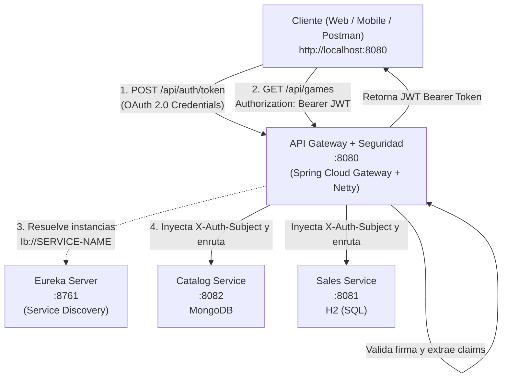

# API Gateway

> **Puerta de enlace unificada (Edge Service), enrutador perimetral de alto rendimiento y servidor de seguridad reactiva**, construido sobre una arquitectura de microservicios con Spring Cloud Gateway reactivo, Spring Cloud Netflix Eureka y JJWT (Java JWT).


---

## Tabla de contenido

1. [Resumen del proyecto](#1-resumen-del-proyecto)
2. [Stack tecnológico y por qué se eligió](#2-stack-tecnológico-y-por-qué-se-eligió)
3. [Ecosistema de microservicios](#3-ecosistema-de-microservicios)
4. [Decisiones de arquitectura](#4-decisiones-de-arquitectura)
5. [Seguridad en Microservicios (OAuth 2.0, JWT, mTLS)](#5-seguridad-en-microservicios-oauth-20-jwt-mtls)
6. [Estrategia de enrutamiento dinámico](#6-estrategia-de-enrutamiento-dinámico)
7. [Estructura del proyecto](#7-estructura-del-proyecto)
8. [Configuración](#8-configuración)
9. [Instalación y ejecución](#9-instalación-y-ejecución)
10. [Batería de pruebas de seguridad y enrutamiento](#10-batería-de-pruebas-de-seguridad-y-enrutamiento)
11. [Solución de problemas](#11-solución-de-problemas)
12. [Mejoras futuras](#12-mejoras-futuras)

---

## 1. Resumen del proyecto

`api-gateway` es el **punto de contacto único (Single Point of Entry)** y la **barrera de seguridad perimetral (Edge Security)** para todas las aplicaciones cliente (Frontend Web, Aplicaciones Móviles, Postman o herramientas de integración) que interactúan con el ecosistema **GameStore**.

| Responsabilidad | Descripción |
|---|---|
| Punto único de entrada | Expone el puerto oficial `8080`, ocultando la topología y puertos internos de los microservicios (`8081`, `8082`). |
| Seguridad Perimetral Reactiva | Intercepta todo el tráfico entrante sobre Netty mediante `JwtAuthenticationFilter`, rechazando peticiones no autenticadas con `401 Unauthorized`. |
| OAuth 2.0 & Token Issuer | Servidor de autorización que expone los flujos `client_credentials` (Machine-to-Machine) y `authorization_code` (usuarios). |
| Enrutamiento dinámico | Redirige peticiones hacia `catalog-service` y `sales-service` basándose en el prefijo de la URL. |
| Balanceo de carga en cliente (Load Balancing) | Utiliza el prefijo `lb://` junto a Spring Cloud LoadBalancer y Eureka para distribuir la carga entre réplicas disponibles. |
| Propagación de Identidad | Inyecta cabeceras internas enriquecidas (`X-Auth-Subject`, `X-Auth-Roles`, `X-Auth-Client`) hacia los microservicios de destino. |

---

## 2. Stack tecnológico y por qué se eligió

| Tecnología | Versión | Función | ¿Por qué se usa? |
|---|---|---|---|
| Java | 17 | Lenguaje de programación | Estabilidad LTS y soporte moderno de records y concurrencia. |
| Spring Boot | 4.1.1 | Framework base | Autoconfiguración y gestión de ciclo de vida del servicio. |
| Spring Cloud Gateway (WebFlux) | 5.0.3 | Motor de enrutamiento y filtros no bloqueantes | Basado en Project Reactor y Netty, maneja miles de conexiones concurrentes sin hilos bloqueantes. |
| JJWT (io.jsonwebtoken) | 0.12.6 | Generación y validación de tokens | Criptografía HMAC-SHA (HS256/HS512), inspección y parsing de claims. |
| Spring Cloud Netflix Eureka Client | 2025.1.3 | Descubrimiento de servicios | Descubre dinámicamente las instancias activas sin requerir IPs estáticas. |
| Spring Cloud LoadBalancer | 5.0.3 | Balanceo de carga | Distribución de peticiones round-robin entre réplicas bajo `lb://`. |
| Maven Wrapper | — | Compilación portable | Garantiza compilación idéntica en cualquier sistema operativo. |

---

## 3. Ecosistema de microservicios



---

## 4. Decisiones de arquitectura

### 4.1 Filtro Global Reactivo (`Ordered.HIGHEST_PRECEDENCE = -1`)
- Se implementó `JwtAuthenticationFilter` implementando `GlobalFilter` y `Ordered`.
- Al tener orden `-1`, se ejecuta **antes** de que el Gateway intente enrutar la petición. Si el token no está presente o la firma es inválida, se devuelve una respuesta reactiva `Mono<Void>` con código `401 Unauthorized` de inmediato sin consumir hilos de backend.

### 4.2 Arquitectura Zero-Trust e Inyección de Cabeceras
- El Gateway actúa como frontera perimetral. Una vez que el JWT es validado, el Gateway muta la petición entrante agregando cabeceras internas:
  - `X-Auth-Subject`: usuario o microservicio solicitante.
  - `X-Auth-Roles`: lista de roles (`ROLE_SERVICE`, `ROLE_USER`, etc.).
  - `X-Auth-Client`: identificador de la aplicación cliente.
- De esta manera, los microservicios internos no necesitan descifrar el JWT repetidamente.

---

## 5. Seguridad en Microservicios (OAuth 2.0, JWT, mTLS)

Este microservicio implementa didáctica y operativamente los tres pilares de seguridad perimetral:

### 5.1 OAuth 2.0 (Flujos Implementados)
- **Flujo `client_credentials` (Machine-to-Machine):** Ideal para comunicación entre microservicios o daemons sin intervención humana. Se valida `clientId` y `clientSecret` para expedir un JWT con rol `ROLE_SERVICE`.
- **Flujo `authorization_code` (Interactivo con usuario):** Flujo de dos fases:
  1. `GET /api/auth/authorize?response_type=code&...` $\rightarrow$ Genera un código de autorización temporal (`AUTH_CODE_...`).
  2. `POST /api/auth/token` $\rightarrow$ El cliente intercambia el código por un JWT firmado con los roles del usuario (`ROLE_USER`, `ROLE_BUYER`).

### 5.2 JSON Web Tokens (JWT)
El servicio `JwtService` firma criptográficamente cada token utilizando HMAC-SHA con clave simétrica secreta de 256/512 bits.
- **Header:** Define el algoritmo (`alg: HS512`) y tipo (`typ: JWT`).
- **Payload (Claims):** Emisor (`iss`), audiencia (`aud`), fecha de emisión (`iat`), expiración (`exp`), sujeto (`sub`), roles y scopes.
- **Signature:** Firma generada a partir de `Base64URL(Header) + "." + Base64URL(Payload)` con la clave privada del Gateway.
- **Inspector en vivo:** El endpoint `POST /api/auth/inspect` desglosa estos componentes para auditoría y aprendizaje.

### 5.3 Mutual TLS (mTLS)
El endpoint `GET /api/auth/mtls-info` documenta la seguridad en capa de transporte Zero-Trust:
- A diferencia de TLS estándar (donde solo el cliente valida al servidor), en **mTLS** ambos extremos presentan y verifican certificados digitales `X.509` firmados por una Autoridad Certificadora (CA) mutua de confianza.
- Elimina ataques *Man-In-The-Middle* dentro de redes de microservicios (usualmente orquestado por un Service Mesh como Istio o Linkerd).

---

## 6. Estrategia de enrutamiento dinámico

| ID de Ruta | Prefijo Predicado | Destino (Eureka) | Seguridad |
|---|---|---|---|
| `catalog-service-route` | `/api/games/**` | `lb://catalog-service` | Protegido (Requiere Bearer JWT) |
| `sales-service-route` | `/api/orders/**` | `lb://sales-service` | Protegido (Requiere Bearer JWT) |
| Rutas públicas | `/api/auth/**`, `/actuator/**` | Local (Gateway) | Público (Acceso libre) |

---

## 7. Estructura del proyecto

```
api-gateway/
├── .mvn/wrapper/
├── src/
│   ├── main/
│   │   ├── java/com/jonathan/gamestore/gateway/
│   │   │   ├── ApiGatewayApplication.java             # Entry point con @EnableDiscoveryClient
│   │   │   ├── auth/
│   │   │   │   ├── controller/
│   │   │   │   │   └── AuthController.java            # Endpoints OAuth 2.0, Inspector y mTLS
│   │   │   │   └── dto/
│   │   │   │       ├── TokenRequest.java              # DTO para peticiones OAuth 2.0
│   │   │   │       └── TokenResponse.java             # DTO estandarizado OAuth 2.0
│   │   │   └── security/
│   │   │       ├── JwtAuthenticationFilter.java       # Filtro Reactivo Global de Netty
│   │   │       └── JwtService.java                    # Generación y validación HMAC-SHA
│   │   └── resources/
│   │       └── application.yml                        # Rutas de Gateway, Eureka y Secreto JWT
│   └── test/
├── mvnw / mvnw.cmd
├── pom.xml                                            # JJWT 0.12.6 + Spring Cloud Gateway
└── README.md
```

---

## 8. Configuración

Archivo: `src/main/resources/application.yml`

```yaml
server:
  port: 8080

spring:
  application:
    name: api-gateway
  cloud:
    gateway:
      discovery:
        locator:
          enabled: true
          lower-case-service-id: true
      routes:
        - id: catalog-service-route
          uri: lb://catalog-service
          predicates:
            - Path=/api/games/**

        - id: sales-service-route
          uri: lb://sales-service
          predicates:
            - Path=/api/orders/**

eureka:
  client:
    enabled: true
    service-url:
      defaultZone: http://localhost:8761/eureka/

jwt:
  secret: "gamestore-super-secure-secret-key-gamestore-2026-very-long-key-32bytes-min"
  expiration-ms: 3600000
```

---

## 9. Instalación y ejecución

### Requisitos previos
- **JDK 17** o superior (`java -version`).
- **Eureka Server** corriendo en `http://localhost:8761`.

```powershell
cd C:\Users\ErickJimz\IdeaProjects\api-gateway
.\mvnw.cmd spring-boot:run
```

---

## 10. Batería de pruebas de seguridad y enrutamiento

Abre una terminal de PowerShell y ejecuta las pruebas contra el Gateway:

### 10.1 Probar Bloqueo Perimetral (Sin Token)
```powershell
try {
    Invoke-RestMethod -Uri "http://localhost:8080/api/games" -Method Get
} catch {
    $_.ErrorDetails.Message
}
```
*Respuesta esperada: `401 Unauthorized` indicando que falta la cabecera Bearer.*

### 10.2 Obtener Token OAuth 2.0 (Client Credentials)
```powershell
$tokenResponse = Invoke-RestMethod -Uri "http://localhost:8080/api/auth/token" -Method Post -ContentType "application/json" -Body '{
    "grantType": "client_credentials",
    "clientId": "sales-service-client",
    "clientSecret": "sales-secret-2026",
    "scope": "games:read games:write orders:create"
}'

$tokenResponse | ConvertTo-Json
$jwt = $tokenResponse.access_token
```

### 10.3 Inspeccionar la Estructura Interna del JWT
```powershell
$inspectBody = @{ token = $jwt } | ConvertTo-Json
Invoke-RestMethod -Uri "http://localhost:8080/api/auth/inspect" -Method Post -ContentType "application/json" -Body $inspectBody | ConvertTo-Json -Depth 5
```

### 10.4 Flujo OAuth 2.0 Authorization Code
```powershell
# Fase 1: Solicitar código de autorización
$auth = Invoke-RestMethod -Uri "http://localhost:8080/api/auth/authorize?response_type=code&client_id=frontend-gamestore&redirect_uri=http://localhost:3000/callback&state=xyz123"
$code = $auth.authorization_code

# Fase 2: Canjear código por Token JWT de usuario
Invoke-RestMethod -Uri "http://localhost:8080/api/auth/token" -Method Post -ContentType "application/json" -Body (@{
    grantType = "authorization_code"
    code = $code
    clientId = "frontend-gamestore"
    redirectUri = "http://localhost:3000/callback"
} | ConvertTo-Json) | ConvertTo-Json
```

### 10.5 Consultar el concepto de Mutual TLS (mTLS)
```powershell
Invoke-RestMethod -Uri "http://localhost:8080/api/auth/mtls-info" -Method Get | ConvertTo-Json -Depth 4
```

---

## 11. Solución de problemas

| Síntoma | Causa probable | Solución |
|---|---|---|
| `401 Unauthorized` en rutas de catálogo u órdenes | No se envió la cabecera `Authorization: Bearer <token>` o el token caducó. | Solicitar un nuevo token mediante `POST /api/auth/token` y enviarlo en el header. |
| `Could not resolve placeholder jwt.secret` | Espacios incorrectos en `application.yml`. | Asegurar que `jwt:` se encuentre al nivel raíz sin sangrías adicionales. |
| `503 Service Unavailable` | El microservicio interno no está registrado en Eureka. | Verificar que `catalog-service` o `sales-service` estén activos en `http://localhost:8761`. |

---

## 12. Mejoras futuras

- **Control de Tasa de Peticiones (Rate Limiting):** Integración con Redis para limitar a 50 peticiones por minuto por IP/Token.
- **CORS Global:** Cabeceras CORS unificadas para Single Page Applications (React / Angular / Vue).
- **Swagger UI Centralizado:** Agrupación OpenAPI de los microservicios en un único portal Swagger en el Gateway.

---

## Autor

**Alger125** · [github.com/Alger125](https://github.com/Alger125)
